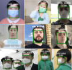

# Face Mask Classification

Tensorflow-2 implementation of face mask classification. 
Given an image of a face, the code can classify if the face is with-mask or without-mask.



For training, we split the dataset into train,validation, test with 80%, 10%, 10% ratio, respectively.
We added aglobal max pooling and a binary classification head on top of a pre-trained [Xception](https://arxiv.org/abs/1610.02357).
## Dataset
Download data from [this link](https://www.kaggle.com/andrewmvd/face-mask-detection).
After downloading the dataset, set `DATASET_ADDRESS` in `settings.py` to the address of the downloaded dataset.
This folder should contain two subdirectories, images and annotations.
## Running the code
Update the `PROJECT_ROOT_ADDRESS` in `settings.py`.
Then run the following command to install the requirements:

```
pip install -r requirments.txt
```

Then you can run `main.py` to train, test and demo the results.

