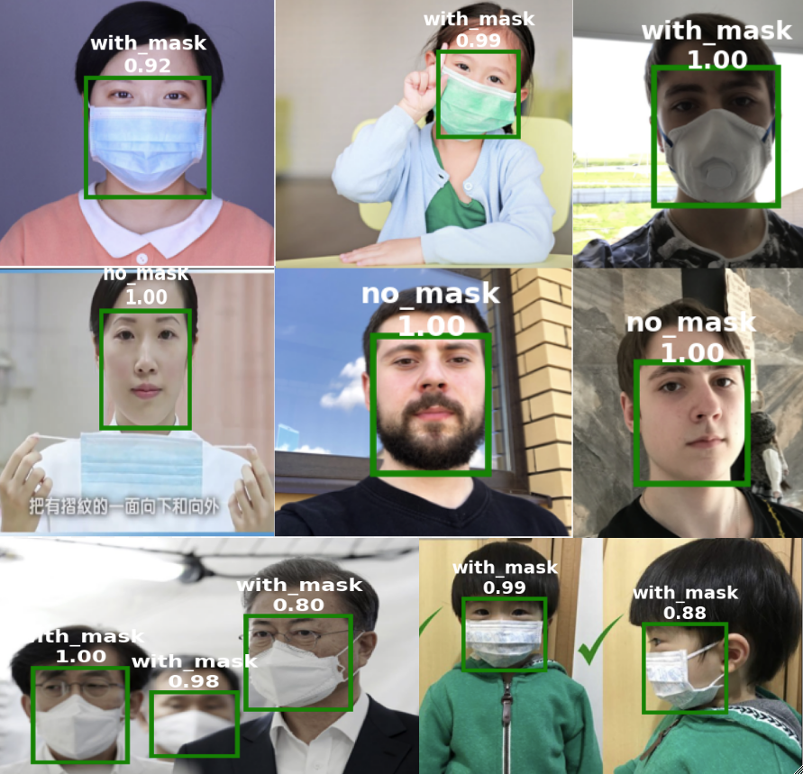

# Face Mask Classification

TensorFlow-2 implementation of face mask classification. 
Given an image of a face, the code can classify if the face is with mask or without mask.



For training, we split the dataset into train,validation, test 
with 80%, 10%, 10% ratio, respectively.
We added a global max pooling and a binary classification 
head on top of a pre-trained
[Xception](https://arxiv.org/abs/1610.02357).
Since the dataset is unbalanced, we duplicate not masked images
during training 
such that we have same amount of images for both classes.

## Dataset
Download data from [this link](https://www.kaggle.com/andrewmvd/face-mask-detection).
After downloading the dataset, set `DATASET_ADDRESS` in `settings.py` to the address of the downloaded dataset.
This folder should contain two subdirectories, images and annotations.

## Running the code
Update the `PROJECT_ROOT_ADDRESS` in `settings.py`.
Then run the following command to install the requirements:

```
pip install -r requirments.txt
```

Then you can run `main.py` to train, test and demo the results.

## Citation
Please cite this paper:
```
@inproceedings{Zehtabian-2020-ICAT-EGVE,
   author = "S. Zehtabian and S. Khodadadeh and K. Kim and G. Bruder and G. F. Welch and L. B{\"o}l{\"o}ni and D. Turgut",
   
   title = "An Automated Virtual Receptionist for Recognizing Visitors and Assuring Mask Wearing",
   booktitle = "International Conference on Artificial Reality and Telexistence / Eurographics Symposium on Virtual Environmnents (ICAT-EGVE-2020)",
   
   year = "2020",
   
   month = "December",
   
   abstract = {
    Virtual receptionists have long been a desire for many circumstances in general. The specific circumstances associated with COVID-19 offer additional     motivations for virtual receptionists, in particular associated with visitor and employee safety.
    In this poster, we present our prototype of a virtual receptionist that employs computer vision and meta-learning techniques to identify and interact with a visitor in a manner similar to that of a human receptionist.
    Specifically we employ a meta-learning-based classifier to learn the users' faces from the minimal data collected during a first visit, such that the receptionist can recognize the same user during follow-up visits. The system also makes use of deep neural network-based computer vision techniques to recognize whether the visitor is wearing a face mask or not.
   }
} 
```
